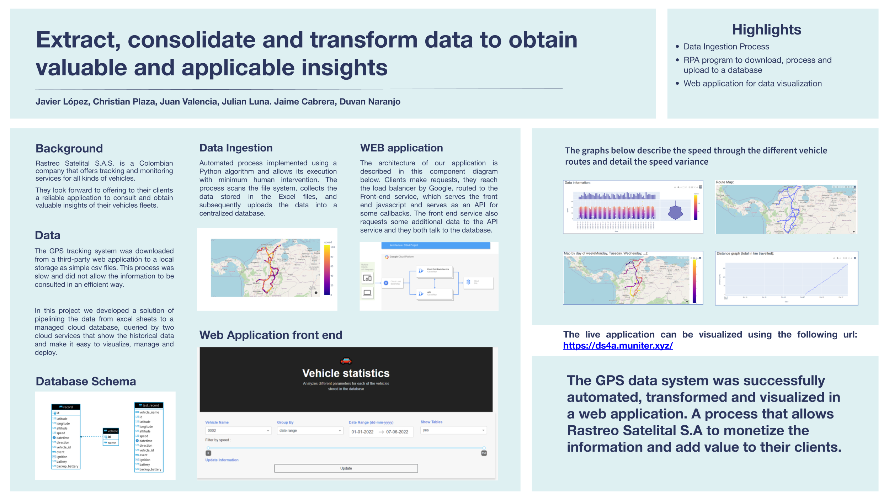

# Extract, consolidate and transform data to obtain valuable and applicable insights

## Team 101  -  DS4A / Colombia - Cohort 6

* [Cristian Plaza](https://www.linkedin.com/in/christian-plaza-ortiz/)
* [Duvan Naranjo](https://www.linkedin.com/in/duvannaranjo/)
* [Jaime Cabrera-Salcedo](https://linkedin.com/in/jaimeh94)
* [Javier López](https://github.com/muniter)
* Juan Carlos Valencia
* Julian Luna

Teaching Assistants: [Jorge Andres Alzate](https://www.linkedin.com/in/jorge-andres-alzate-hoyos) and [Gonzalo Cossio](https://www.linkedin.com/in/gonzalo-cossio-escobar-0697a5115/)
## Introduction
Data Science for All (DS4A) Colombia, is an intensive training program oriented to providing skills in data science and related subjects.

This program is sponsored by MinTiC (Ministry of Information Technology of Colombia) and developed by Correlation One. The authors of the present document were enrolled in cohort #6 of this program, held between March and July of 2022.

Besides attending classes and presenting the regular assignments, the students enrolled in this program must complete a Capstone Project, which is a team initiative to solve one real-world business problem or opportunity, applying the tools and methods learned during the DS4A program.



## Installation

**Instruction for Linux/Unix systems.**

##### 1. Create virtual environment and install dependencies:

```bash
python -m venv .venv
source .venv/bin/activate
pip3 install -r requirements.txt
```

##### 2. Configure the application environment

Copying the file `env` to `.env` and giving proper values to the variables.

##### 3. Run the application:

```bash
FLASK_APP="gps_backend" flask run
```

Now the API should be reachable under `localhost:5000`.
